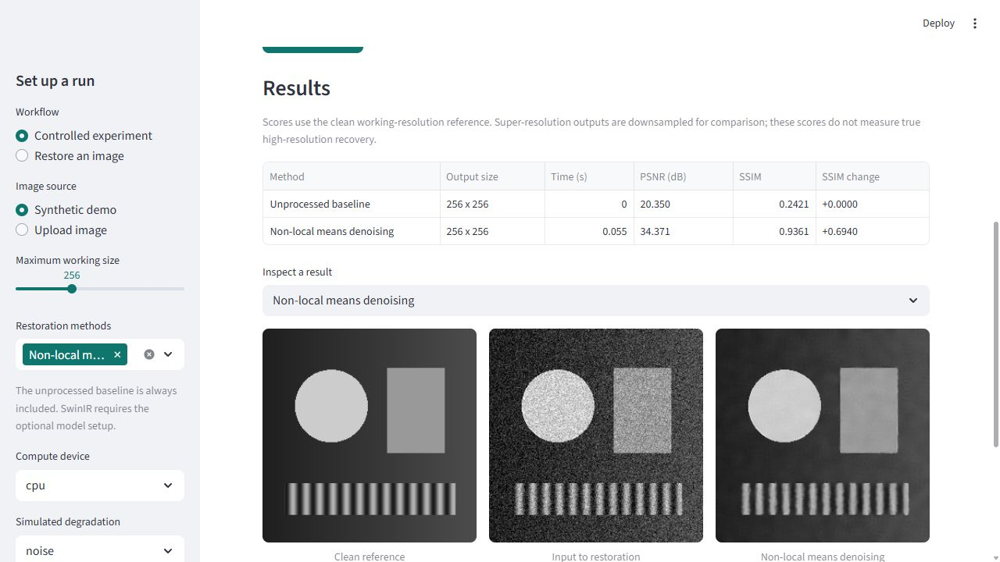

# VisionX Pro

A runnable image-restoration research app with reproducible degradation experiments,
pretrained SwinIR inference, classical baselines, and measured reports.

See [validation notes](VALIDATION.md) for actual tests and example measurements.

## Features

- Restore an uploaded image, or run a controlled degradation experiment.
- Compare the unprocessed baseline, non-local means, unsharp masking, CLAHE, and SwinIR.
- Use separate pretrained SwinIR checkpoints for grayscale denoising and 2x super-resolution.
- Measure PSNR, SSIM, MSE, and processing time when a clean reference exists.
- Export images, CSV, JSON configuration/metrics, and a text report in one ZIP.
- Optionally request an experimental Gemini image-quality description after authorizing image transmission.

This is **not a diagnostic system**. There is no disease classifier, clinical validation,
medical fine-tuning, or claim of diagnostic accuracy. The demo is a geometric test image.
SwinIR is pretrained upstream on general image data. Restoration can alter or invent details.

## Quick start (Python 3.12)

From this directory:

~~~text
python -m venv .venv
~~~

Activate with `.venv\Scripts\Activate.ps1` on Windows PowerShell or
`source .venv/bin/activate` on macOS/Linux, then:

~~~text
python -m pip install -r requirements.txt
python -m streamlit run app.py
~~~

Classical methods and the demo need no model downloads, GPU, API credentials, or external AI requests.
If Streamlit asks for an email, you can leave it blank. The launch configuration binds to localhost.

## Enable pretrained SwinIR

~~~text
python -m pip install -r requirements-models.txt
python download_models.py --model all
~~~

Downloads: approximately 123 MB for denoising and 67 MB for 2x SR.
Select SwinIR after installation. CPU works but can be slow.
For CUDA, use the official PyTorch installation instructions for a compatible
PyTorch 2.7.1 / torchvision 0.22.1 build and your driver.

Inference uses overlapping 128-pixel tiles to limit memory. Overlap is averaged;
results can differ from whole-image inference. The architecture is vendored at a fixed commit.
Weights are loaded strictly with weights_only=True. The downloader uses HTTPS, a temporary file,
size checks, and a recorded SHA-256. This detects later corruption; it is not a publisher signature.
Weights and credentials are ignored by Git.

## Command-line examples

~~~text
python -m visionx.cli --demo --methods nlm unsharp clahe --output runs/demo.zip
python -m visionx.cli --input example.png --mode restore --methods nlm --output runs/restored.zip
python -m visionx.cli --input example.png --mode experiment --degradation noise --severity 0.0980392157 --seed 42 --methods swinir_denoise nlm --output runs/comparison.zip
python -m visionx.cli --input example.png --mode restore --methods swinir_sr --device cpu --output runs/super-resolution.zip
~~~

Input paths are local; output paths are explicit. Use --weights DIRECTORY for another model folder.

## Evaluation

A controlled experiment treats the resized uploaded image as its reference, applies one
selected degradation, and compares all selected methods on that same input.
The unprocessed baseline is always included, so deterioration is visible.

- PSNR uses data_range=1. An exact match has infinite PSNR, encoded as null plus exact_match=true.
- SSIM uses single-channel [0, 1] images at the working resolution.
- 2x outputs are bicubically downsampled to reference size before metrics. This measures
  reconstruction at the working resolution, not actual high-resolution detail recovery.
- Direct restoration has no reference: no PSNR or SSIM is manufactured.
- Timings cover the restore call and CPU output transfer; model loading is excluded when preloaded.
  Single-run timings are not throughput benchmarks.
- Noise uses a local seeded generator. GPU outputs can vary across hardware/software.
- A single synthetic example is not a benchmark or clinical validation. Higher pixel similarity
  does not establish preserved pathology or diagnostic accuracy.

Severity is [0, 1]: noise standard deviation = severity; Gaussian sigma = 3 x severity;
horizontal motion kernel = 2 x max(1, round(7 x severity)) + 1 for nonzero severity;
contrast slope = 1 - severity. Zero severity is identity for every corruption.
These are simple synthetic corruptions, not calibrated scanner models.

## Input handling

PNG, JPEG, and single-frame 8-bit TIFF up to 10 MB / 16 megapixels are supported.
EXIF orientation is applied, transparency is composited over white, and images become grayscale.
Maximum working size preserves aspect ratio. Raw 16-bit/float data, DICOM, and multi-frame
images are explicitly rejected. Export an appropriate 8-bit preview outside this app if needed.
Exported PNGs omit original metadata; visible burned-in identifiers can remain.

## Optional Gemini review

Enter a currently available image-capable Gemini model ID and API key in the app, or set
GEMINI_MODEL and GEMINI_API_KEY in your environment. No retired model is hard-coded.

A checkbox and request button authorize sending the input and selected processed image to Google.
Ordinary processing and exports stay local. The prompt asks about visual quality/artifacts,
not diagnosis or treatment. Output is unvalidated AI commentary and excluded from measured reports.
Incomplete/blocked responses are rejected; API failure preserves local results.
API keys are sent in a header and never written to reports. Live access requires your own credentials.
API behavior is tested using mocked responses.

## Structure

~~~text
app.py                   Streamlit interface
download_models.py       Explicit, atomic upstream checkpoint downloader
visionx/images.py        Input validation, resizing, encoding, synthetic target
visionx/processing.py    Degradation, baselines, metrics, experiment runner
visionx/models.py        Pretrained loading, device selection, tiled inference
visionx/gemini.py        Opt-in external qualitative review
visionx/reporting.py     Reports and ZIP export
visionx/cli.py           Command-line interface
visionx/vendor/          Pinned SwinIR architecture and license
tests/                   Processing, export, failure-handling, app tests
~~~

## Tests

~~~text
python -m pip install -r requirements-dev.txt
python -m pytest -q
~~~

Default tests need neither model weights nor external AI calls.
The GitHub Actions workflow runs the suite on Python 3.12.

## What changed

Removed Colab-only commands/paths, random-image fallback after invalid uploads,
hard-coded clinical benefits, automatic diagnosis/treatment prompts, fixed preference
for the noise result, startup downloads, and report truncation.

Added the app/CLI, separate model tasks, input validation, seeded experiments,
reference-based metrics, baseline comparisons, output bundles, dependency versions,
pinned architecture, tests, and documentation.

## Accurate portfolio description

"Developed an image-restoration prototype integrating pretrained SwinIR denoising and
super-resolution with classical baselines, reproducible degradation experiments, PSNR/SSIM
evaluation, and a Streamlit interface with downloadable reports."

Use this description after you understand the revised implementation. Do not claim model
training, EfficientNet/U-Net++, disease-classification accuracy, or clinical validation.
See THIRD_PARTY_NOTICES.md for upstream attribution.

